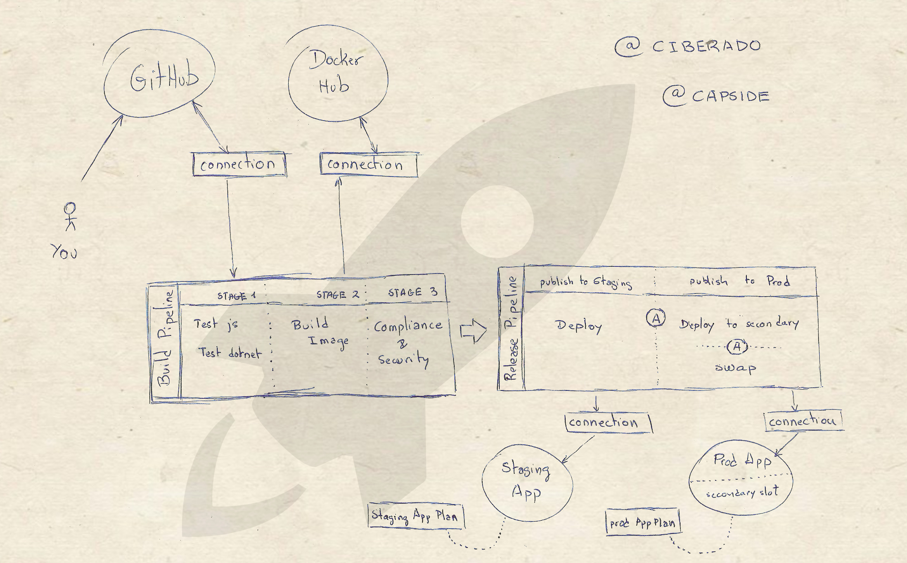

# Azure DevOps Pipelines full demo

This is a quite complete example of how to create a build and release pipeline. And it comes it two flavours, so choose your weapon:

* [dotnet](https://github.com/capside/azure-devops-workshop/tree/dotnet)
* [perl](https://github.com/capside/azure-devops-workshop/tree/perl)